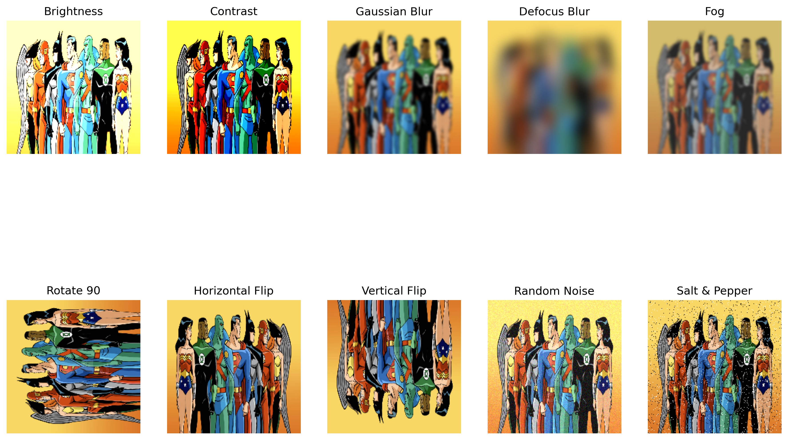

# 🛡️ Deep Learning Model Robustness Analysis

<div align="center">


**Evaluating the robustness of popular pre-trained image classification models against real-world perturbations**

[🔗 **View Repository**](https://github.com/cbratkovics/robustness-analysis) | [📊 **Results**](#-results--findings) | [🚀 **Quick Start**](#-quick-start)

</div>

---

## 🎯 **Project Overview**

In real-world applications, image classification models encounter various perturbations that can dramatically affect their performance. This project provides a comprehensive robustness analysis of four popular pre-trained models against common image distortions.

### 🔍 **What We Analyzed**
- **4 State-of-the-art Models**: VGG16, ResNet50, DenseNet121, EfficientNetB0
- **10 Real-world Perturbations**: From lighting changes to noise corruption
- **2 Evaluation Metrics**: Prediction consistency + Feature similarity analysis

---

## 🖼️ **Visual Comparison**

<div align="center">

### 📸 Original vs Perturbed Images

| Original Image | Applied Perturbations |
|:---:|:---:|
|  |  |

</div>

---

## 🏗️ **Model Architecture Overview**

<div align="center">

| Model | Type | Parameters | ImageNet Top-5 Accuracy |
|:---:|:---:|:---:|:---:|
| **VGG16** | Deep CNN | 138M | 90.1% |
| **ResNet50** | Residual Network | 25.6M | 92.1% |
| **DenseNet121** | Dense Connectivity | 8.0M | 93.6% |
| **EfficientNetB0** | Efficient Architecture | 5.3M | 93.3% |

</div>

### 🎨 **Why These Models?**
- ✅ **Architectural Diversity**: Different design philosophies
- ✅ **Consistent Input**: All use 224×224 pixel images
- ✅ **ImageNet Pre-training**: Fair comparison baseline
- ✅ **Industry Relevance**: Widely used in production

---

## 🔬 **Perturbation Test Suite**

We applied **10 carefully selected perturbations** that mirror real-world scenarios:

<div align="center">

| 🌟 **Lighting & Quality** | 🔄 **Geometric** | 📡 **Noise** |
|:---:|:---:|:---:|
| Increased Brightness | 90° Rotation | Random Noise |
| Increased Contrast | Horizontal Flip | Salt & Pepper Noise |
| Gaussian Blur | Vertical Flip | |
| Defocus Blur | | |
| Fog Effect | | |

</div>

---

## 📊 **Results & Findings**

### 🏆 **Prediction Consistency Champions**

<div align="center">

| 🥇 **Rank** | **Model** | **Consistency Score** | **Performance** |
|:---:|:---:|:---:|:---:|
| 1️⃣ | **DenseNet121** | **90%** | 🟢 Excellent |
| 2️⃣ | **VGG16** | **40%** | 🟡 Moderate |
| 3️⃣ | **EfficientNetB0** | **20%** | 🟠 Poor |
| 4️⃣ | **ResNet50** | **0%** | 🔴 Failed |

</div>

### 📈 **Feature Similarity Analysis**

<div align="center">

| **Model** | **Cosine Similarity** | **Euclidean Similarity** | **Overall Robustness** |
|:---:|:---:|:---:|:---:|
| **DenseNet121** | **0.65** 🥇 | **0.94** 🥈 | 🟢 **Most Robust** |
| **VGG16** | **0.62** 🥈 | **0.91** 🥉 | 🟡 Moderate |
| **ResNet50** | **0.47** 🥉 | **0.95** 🥇 | 🟠 Inconsistent |
| **EfficientNetB0** | **0.27** | **0.85** | 🔴 Least Robust |

</div>

---

## 🎯 **Key Insights**

<div align="center">

### 🏅 **The Winner: DenseNet121**

</div>

> **DenseNet121** emerged as the clear winner, demonstrating exceptional robustness across all metrics.

**🔍 What makes DenseNet121 special?**
- ✅ **90% Prediction Consistency** - Only changed predictions on 1 out of 10 perturbations
- ✅ **Highest Cosine Similarity** - Feature representations remain stable
- ✅ **Strong Euclidean Performance** - Consistent feature magnitude preservation
- ✅ **Dense Connectivity** - Information flows efficiently through skip connections

### 🚨 **The Surprise: ResNet50**

Despite having **excellent feature similarity (0.95 Euclidean)**, ResNet50 **failed completely** in prediction consistency (0%). This reveals a critical insight:

> **Feature stability ≠ Prediction robustness**

---

## 🛠️ **Technical Implementation**

### 🔧 **Core Functions**

```python
# Key implementation highlights
ptb_apply()          # Applies perturbations systematically
extract_features()   # Extracts intermediate feature maps
cosine_eval()       # Computes cosine similarity metrics
euclidean_eval()    # Computes euclidean distance metrics
```

### 📦 **Dependencies**
- **TensorFlow/Keras**: Model loading and inference
- **Pillow (PIL)**: Image perturbation pipeline
- **NumPy**: Numerical computations
- **Matplotlib**: Visualization and plotting

---

## 🚀 **Quick Start**

```bash
# Clone the repository
git clone https://github.com/cbratkovics/robustness-analysis.git
cd robustness-analysis

# Install dependencies
pip install -r requirements.txt

# Run the analysis
python robustness_analysis.py
```

---

## 🔮 **Future Enhancements**

<div align="center">

| 🎯 **Planned Improvements** |
|:---:|
| 📊 **Multi-image Dataset** - Expand beyond single image testing |
| 🎭 **Adversarial Perturbations** - Include adversarial attack scenarios |
| 🧪 **Additional Models** - Test Vision Transformers and modern architectures |
| 📱 **Real-time Demo** - Interactive web application for live testing |
| 📈 **Automated Reporting** - Generate comprehensive analysis reports |

</div>

---

## 🤝 **Contributing**

We welcome contributions! Please feel free to:
- 🐛 Report bugs or issues
- 💡 Suggest new perturbations to test
- 🔧 Improve the analysis methodology
- 📚 Enhance documentation

---

## 📄 **License**

This project is licensed under the MIT License - see the [LICENSE](LICENSE) file for details.

---

<div align="center">

**Created with ❤️ by [Christopher Bratkovics](https://github.com/cbratkovics)**

⭐ **Star this repo if you found it helpful!** ⭐

[](https://github.com/cbratkovics/robustness-analysis)
[](https://github.com/cbratkovics/robustness-analysis)

</div>
